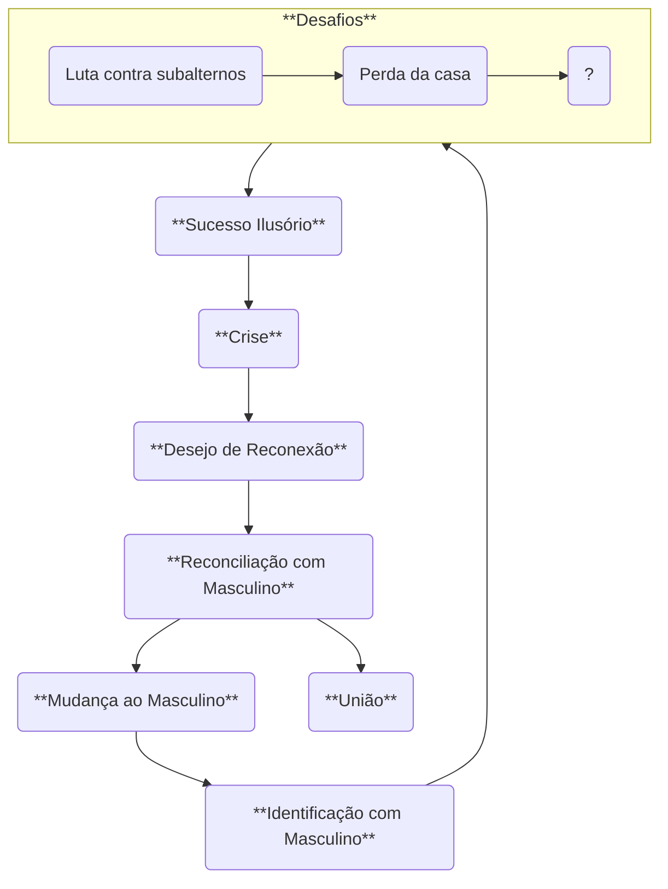

## Estrutura

```mermaid
flowchart TD
  subgraph C ["**Desafios**"]
    direction LR
    C1("Luta contra subalternos") --> C2("Perda da casa")
    C2 --> C3("?")
  end
  A("**Mudança ao Masculino**<br>") --> B("**Identificação com Masculino**")
  B --> C
  C --> D("**Sucesso Ilusório**")
  D --> E("**Crise**")
  E --> F("**Desejo de Reconexão**")
  F --> G("**Reconciliação com Masculino**")
  G --> H("**União**")
  G --> A
```

## História

Era uma vez um gato muitíssimo serelepe, nascido sob uma família antiga e bem-estabelecida
